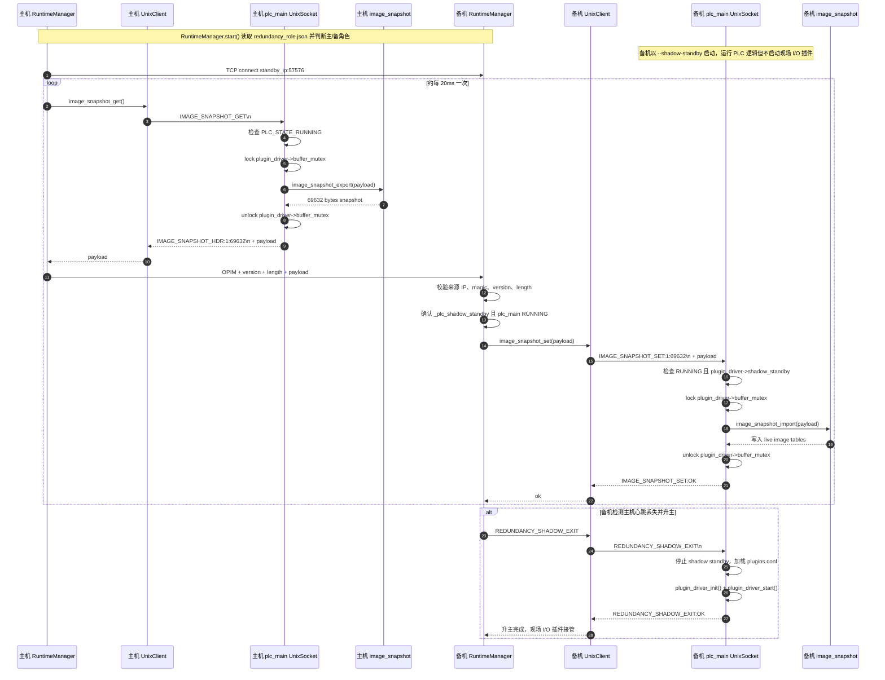

# plc热冗余数据同步基线的业务逻辑

## 结论摘要

当前主/备机 PLC 的 IO image tables 同步，是由 `webserver/runtimemanager.py` 启动的热冗余 TCP 同步线程完成的。

主机周期性从本机 `plc_main` 的 Unix socket 拉取一份完整 image snapshot，然后通过冗余网口 TCP 发送给备机。备机只在 shadow standby 模式下接收该 snapshot，并通过本机 `plc_main` 的 Unix socket 写入本地 live image tables。

底层同步对象不是单独的数据表文件，而是 C 运行时中的全量内存镜像指针数组：

- `bool_input[1024][8]`
- `bool_output[1024][8]`
- `byte_input[1024]`
- `byte_output[1024]`
- `int_input[1024]`
- `int_output[1024]`
- `dint_input[1024]`
- `dint_output[1024]`
- `lint_input[1024]`
- `lint_output[1024]`
- `int_memory[1024]`
- `dint_memory[1024]`
- `lint_memory[1024]`
- `bool_memory[1024][8]`

每行固定 68 字节，总长度为 `1024 * 68 = 69632` 字节，协议版本为 `IMAGE_SNAPSHOT_VERSION = 1`。

## 涉及源码文件

| 文件 | 作用 |
| --- | --- |
| `webserver/runtimemanager.py` | 判断主/备角色，启动热冗余心跳线程和 IO 镜像同步线程；主机发送 snapshot，备机接收 snapshot。 |
| `webserver/unixclient.py` | Web 层访问本机 `plc_main` Unix socket 的客户端；实现 `IMAGE_SNAPSHOT_GET` 和 `IMAGE_SNAPSHOT_SET`。 |
| `core/src/plc_app/unix_socket.c` | `plc_main` 内部 Unix socket 服务端；处理 `IMAGE_SNAPSHOT_GET` / `IMAGE_SNAPSHOT_SET` / `REDUNDANCY_SHADOW_EXIT`。 |
| `core/src/plc_app/image_snapshot.c` | 将 live image tables 序列化为二进制 snapshot，或把 snapshot 反序列化写回 live image tables。 |
| `core/src/plc_app/image_snapshot.h` | 定义 snapshot 版本、行大小、总大小和导入导出接口。 |
| `core/src/plc_app/image_tables.c` | 定义 PLC I/O 与 memory image tables，并将表指针传给编译后的 PLC 程序。 |
| `core/src/plc_app/image_tables.h` | 声明 image tables、PLC 动态符号和 image table 辅助函数。 |
| `core/src/plc_app/plc_main.c` | 识别 `--shadow-standby` / `OPENPLC_SHADOW_STANDBY=1`，设置插件驱动进入 shadow standby。 |
| `core/src/drivers/plugin_driver.c` | shadow standby 时跳过现场 I/O 插件加载、初始化、启动和 cycle hook；正常模式下为插件提供 image table 指针和 mutex。 |
| `core/src/drivers/plugin_driver.h` | 定义 `plugin_driver_t.shadow_standby`。 |
| `core/src/plc_app/plc_state_manager.c` | PLC 扫描周期持有 `buffer_mutex` 执行 journal、插件 cycle hook、PLC 逻辑；初始化 image table 指针。 |
| `core/src/plc_app/redundancy_ipc.c` | 备机升主时执行 `REDUNDANCY_SHADOW_EXIT`，退出 shadow standby 并重新加载现场 I/O 插件。 |

## 关键常量和协议

### Web 层 TCP 同步协议

位置：`webserver/runtimemanager.py`

- `REDUNDANCY_IMAGE_SYNC_PORT = 57576`
- `REDUNDANCY_IMAGE_MAGIC = b"OPIM"`

主机发送给备机的 TCP 包格式：

```text
struct.pack("!4sII", b"OPIM", IMAGE_SNAPSHOT_PROTOCOL_VERSION, payload_len)
payload
```

其中：

- `IMAGE_SNAPSHOT_PROTOCOL_VERSION = 1`
- `payload_len = IMAGE_SNAPSHOT_EXPECTED_BYTES = 1024 * 68`

### plc_main Unix socket 协议

位置：`core/src/plc_app/unix_socket.c`、`webserver/unixclient.py`

主机 Web 层向本机 `plc_main` 发送：

```text
IMAGE_SNAPSHOT_GET\n
```

`plc_main` 返回：

```text
IMAGE_SNAPSHOT_HDR:1:69632\n
<69632 bytes payload>
```

备机 Web 层向本机 `plc_main` 发送：

```text
IMAGE_SNAPSHOT_SET:1:69632\n
<69632 bytes payload>
```

`plc_main` 成功写入后返回：

```text
IMAGE_SNAPSHOT_SET:OK\n
```

## 启动和角色判断调用链

1. `RuntimeManager.start()`  
   文件：`webserver/runtimemanager.py:1829`

2. `RuntimeManager._evaluate_redundancy_role()`  
   文件：`webserver/runtimemanager.py:812`

   读取 `redundancy_role.json`，根据冗余心跳网卡的本机 IPv4 与配置中的 master / standby IPv4 比较：

   - 本机 IP 等于 master IP：`is_redundancy=True`，`is_master=True`
   - 本机 IP 等于 standby IP：`is_redundancy=True`，`is_master=False`，并设置 `_plc_shadow_standby = not _standby_switched_to_master`

3. `RuntimeManager.start()` 启动 `plc_main`  
   文件：`webserver/runtimemanager.py:1865`

   如果 `_plc_shadow_standby` 为真，启动命令追加：

   ```text
   --shadow-standby
   ```

4. `plc_main.c` 解析 shadow standby  
   文件：`core/src/plc_app/plc_main.c:40`、`core/src/plc_app/plc_main.c:60`、`core/src/plc_app/plc_main.c:119`

   `plc_main` 支持两种方式进入 shadow standby：

   - 命令行参数：`--shadow-standby`
   - 环境变量：`OPENPLC_SHADOW_STANDBY=1`

   进入后调用：

   ```c
   plugin_driver_set_shadow_standby(plugin_driver, 1);
   ```

5. `RuntimeManager._start_redundancy_heartbeat_threads()`  
   文件：`webserver/runtimemanager.py:1704`

   - 主机启动 `_redundancy_master_tcp_heartbeat_loop` 和 `_redundancy_image_sync_master_loop`
   - 备机启动 `_redundancy_standby_tcp_heartbeat_loop` 和 `_redundancy_image_sync_standby_loop`

## 主机 IO image tables 导出和发送调用链

1. `RuntimeManager._redundancy_image_sync_master_loop()`  
   文件：`webserver/runtimemanager.py:1524`

   主机循环连接备机：

   ```python
   sock.connect((standby_ip, REDUNDANCY_IMAGE_SYNC_PORT))
   ```

2. `UnixClient.image_snapshot_get()`  
   文件：`webserver/unixclient.py:144`

   Web 层通过本机 Unix socket 向 `plc_main` 发送：

   ```python
   self.sock.sendall(b"IMAGE_SNAPSHOT_GET\n")
   ```

3. `unix_socket_thread()` 处理 `IMAGE_SNAPSHOT_GET`  
   文件：`core/src/plc_app/unix_socket.c:220`

   前置条件：

   - `plugin_driver` 存在
   - `plc_get_state() == PLC_STATE_RUNNING`

   然后持有 `plugin_driver->buffer_mutex`：

   ```c
   plugin_mutex_take(&plugin_driver->buffer_mutex);
   image_snapshot_export(payload, IMAGE_SNAPSHOT_TOTAL_BYTES, &out_len);
   plugin_mutex_give(&plugin_driver->buffer_mutex);
   ```

   位置：`core/src/plc_app/unix_socket.c:245`

4. `image_snapshot_export()`  
   文件：`core/src/plc_app/image_snapshot.c:96`

   逐行调用 `export_row()`，把每个 index 下的 bool / byte / int / dint / lint I/O 和 memory 全部打包。

5. `RuntimeManager._redundancy_image_sync_master_loop()` 发送 TCP snapshot  
   文件：`webserver/runtimemanager.py:1562`

   拿到 payload 后校验长度，再发送：

   ```python
   header = struct.pack("!4sII", REDUNDANCY_IMAGE_MAGIC, IMAGE_SNAPSHOT_PROTOCOL_VERSION, len(payload))
   sock.sendall(header + payload)
   time.sleep(0.02)
   ```

   也就是说，当前主机同步间隔约为 20ms 一次；如果拉取失败或 TCP 异常，会短暂 sleep 后重试或重连。

## 备机 IO image tables 接收和导入调用链

1. `RuntimeManager._redundancy_image_sync_standby_loop()`  
   文件：`webserver/runtimemanager.py:1598`

   备机绑定本机冗余网口 IP 和 `57576` 端口：

   ```python
   server.bind((local_ip, REDUNDANCY_IMAGE_SYNC_PORT))
   ```

2. 仅接受配置中的主机 IP  
   文件：`webserver/runtimemanager.py:1640`

   如果连接来源不是 `master_ip`，备机会拒绝连接。

3. 校验 TCP header  
   文件：`webserver/runtimemanager.py:1658`

   备机读取 12 字节 header 并校验：

   - magic 必须等于 `b"OPIM"`
   - version 必须等于 `1`
   - length 必须等于 `69632`

4. 只在 shadow standby 且 PLC 正在运行时写入  
   文件：`webserver/runtimemanager.py:1672`

   写入前置条件：

   - `runtime_socket` 已连接
   - `_plc_shadow_standby == True`
   - `_plc_runtime_is_running() == True`

5. `UnixClient.image_snapshot_set(body)`  
   文件：`webserver/unixclient.py:210`

   Web 层向本机 `plc_main` 发送：

   ```text
   IMAGE_SNAPSHOT_SET:1:69632\n
   <payload>
   ```

6. `unix_socket_thread()` 处理 `IMAGE_SNAPSHOT_SET`  
   文件：`core/src/plc_app/unix_socket.c:272`

   C 端前置条件：

   - header 能解析出 version 和 size
   - version 等于 `IMAGE_SNAPSHOT_VERSION`
   - size 等于 `IMAGE_SNAPSHOT_TOTAL_BYTES`
   - `plc_get_state() == PLC_STATE_RUNNING`
   - `plugin_driver->shadow_standby == true`

   注意：这一点很关键，普通主机或已升主的备机不会接受 `IMAGE_SNAPSHOT_SET`。

7. `image_snapshot_import()`  
   文件：`core/src/plc_app/unix_socket.c:313`、`core/src/plc_app/image_snapshot.c:113`

   C 端持有 `plugin_driver->buffer_mutex` 后，把 payload 逐行写回 live image tables：

   ```c
   plugin_mutex_take(&plugin_driver->buffer_mutex);
   image_snapshot_import(payload, (size_t)sz);
   plugin_mutex_give(&plugin_driver->buffer_mutex);
   ```

## image tables 初始化和扫描周期关系

1. `plc_cycle_thread()` 启动后加载 PLC 动态符号  
   文件：`core/src/plc_app/plc_state_manager.c:62`

2. `symbols_init()` 把运行时 image table 指针传给编译后的 PLC 程序  
   文件：`core/src/plc_app/image_tables.c:118`

   优先调用 v4：

   ```c
   ext_setBufferPointers_v4(..., bool_memory);
   ```

   如果没有 v4，则回退：

   ```c
   ext_setBufferPointers(...);
   ```

3. `ext_glueVars()` 建立 PLC located variables 与 image tables 的指针映射  
   文件：`core/src/plc_app/plc_state_manager.c:75`

4. `image_tables_fill_null_pointers()` 补齐未被 PLC 程序使用的地址  
   文件：`core/src/plc_app/plc_state_manager.c:80`、`core/src/plc_app/image_tables.c:163`

   这样 snapshot 导出/导入时即使访问未使用地址，也不会遇到 NULL 指针。

5. PLC 每个扫描周期持有同一个 `buffer_mutex`  
   文件：`core/src/plc_app/plc_state_manager.c:178`

   周期内顺序：

   - `journal_apply_and_clear()`
   - `plugin_driver_cycle_start(plugin_driver)`
   - `ext_config_run__(tick__++)`
   - `ext_updateTime()`
   - `plugin_driver_cycle_end(plugin_driver)`

   因为 snapshot GET/SET 也使用 `plugin_driver->buffer_mutex`，所以导出/导入与 PLC 扫描周期互斥，避免读写同一 image table 时发生并发破坏。

## shadow standby 的业务含义

备机 shadow standby 的核心策略是：

- 备机运行相同 PLC 逻辑。
- 备机不加载、不启动现场 I/O 插件。
- 备机通过主机推送的 snapshot 保持 image tables 与主机一致。
- 当备机升主时，通过 `REDUNDANCY_SHADOW_EXIT` 退出 shadow standby，重新加载现场 I/O 插件，并保留当前 PLC 进程和 I/O 镜像。

相关代码：

- `plugin_driver_update_config()` 在 shadow standby 时把 `plugin_count` 设为 0：`core/src/drivers/plugin_driver.c:189`
- `plugin_driver_init()` 在 shadow standby 时跳过插件初始化：`core/src/drivers/plugin_driver.c:299`
- `plugin_driver_start()` 在 shadow standby 时跳过插件启动：`core/src/drivers/plugin_driver.c:412`
- `plugin_driver_cycle_start()` / `plugin_driver_cycle_end()` 在 shadow standby 时直接返回：`core/src/drivers/plugin_driver.c:1048`、`core/src/drivers/plugin_driver.c:1079`
- `REDUNDANCY_SHADOW_EXIT` 重新启用插件：`core/src/plc_app/redundancy_ipc.c:1`

## UML 时序图



## 当前基线行为边界

1. 同步粒度是全量 snapshot，不是增量变更。
2. payload 不带业务级时间戳、scan counter 或校验和；只有 magic、version、length。
3. 备机只允许配置中的 master IP 写入 TCP 镜像。
4. C 端 `IMAGE_SNAPSHOT_SET` 只允许 shadow standby 写入，避免普通主机或已升主节点被远端覆盖。
5. 同步内容包含 I/O 和 memory image，不只包含物理 I/O。
6. snapshot 与 PLC scan cycle 通过同一个 `buffer_mutex` 互斥，保证单次导出/导入期间 image table 不被 PLC 线程同时修改。
7. shadow standby 不启动现场 I/O 插件，所以备机的现场 I/O 不直接影响 image tables；其 image tables 由主机 snapshot 驱动。

